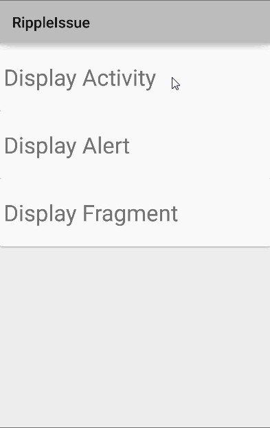

# RippleIssue

I'm trying to simulate the ripple effect in [this](https://developer.android.com/design/material/videos/ContactsAnim.mp4) (source: [Material Design](https://developer.android.com/design/material/index.html)),  but for some reason it's not working when I show a fragment onClick.  It works if I launch an Activity or show an AlertDialog, but not if I launch into a DetailFragment.

###GIF Showing Issue

